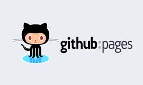
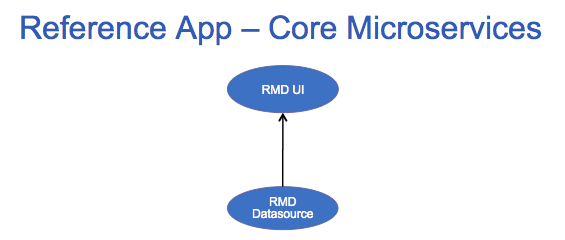
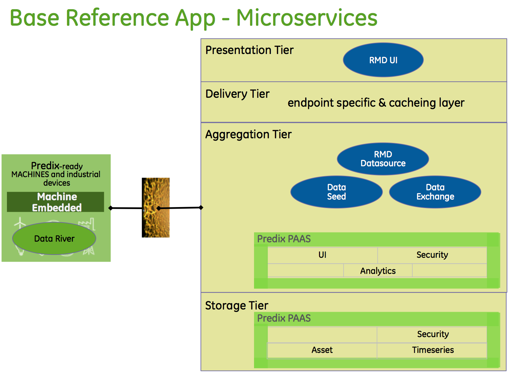
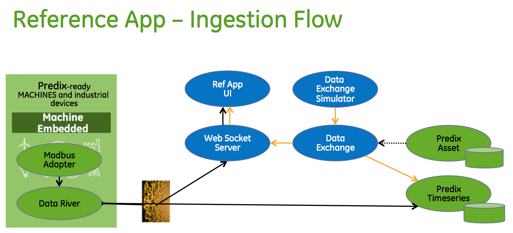
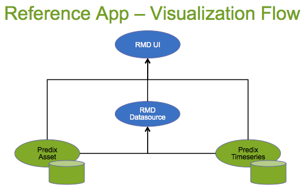
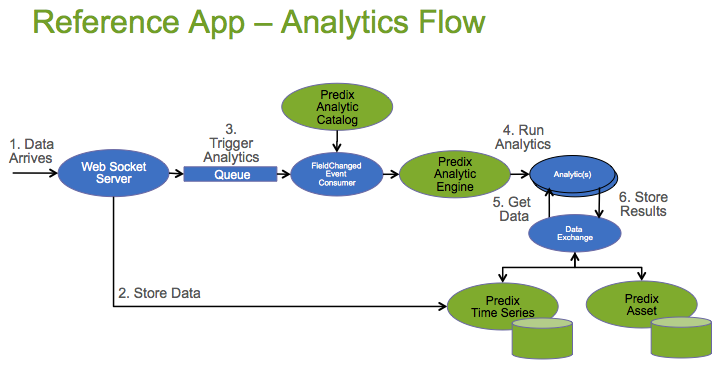

<a href="http://predixdev.github.io/predix-rmd-ref-app" target="_blank">
	
</a>
Predix RMD Reference App 
=====================

Welcome to the Predix Remote Monitoring & Diagnostics (RMD) Reference Application.  The Predix platform enables you to create applications with an Industrial Internet focus and allows you to manage and scale those applications as they are consumed by your end users.  

The RMD Reference App shows developers and architects how to use and leverage all of the Predix application building block Services you find in the [Catalog](https://www.predix.io/catalog).  So, it only has some aspects of a fully featured RMD application.  Instead, it's intent is to show developers and architects a best-practices microservices application architecture integrating with all the underlying Predix Services.  It will save you a few weeks or months of effort if you leverage the components inside.    

You can view a running version of the  [Reference App](https://rmd-ref-app.run.aws-usw02-pr.ice.predix.io/dashboard) in your browser using these login credentials

        User: app_user_1
        Password: app_user_1
        
You can view our <a href=https://youtu.be/2MGPTJ8yjyc target="_blank">Video</a> and later run the [deployment script ](https://predix.io/resources/tutorials/tutorial-details.html?tutorial_id=1473&tag=1610&journey=Connect%20devices%20using%20the%20Reference%20App&resources=1592,1473,1600#deploy) (scroll down to 'Download and Install'), which will push the Reference App to your own Cloud Foundry space so you can quickly start trying out various Predix Services.

Now, take a few moments to learn all about  Predix, using Reference App as a guide.  There is lots to discover and soon you'll be creating Predix Apps of your own.

##Predix Integration
The Reference App Front-End and Back-End Microservices demonstrate how to use the Predix PAAS to build an Industrial Internet application.  The app takes advantage of the following Predix components:

- [Predix Dashboard UI Seed](https://github.com/predixdev/predix-seed)
- [Predix Security](https://www.predix.io/docs#Jig2gorb)
- [Predix Asset](https://www.predix.io/docs#zChUPu1U)
- [Predix Timeseries](https://www.predix.io/docs#mnlfuvZz)
- [Predix Analytics](https://www.predix.io/docs#EG3xVdLg)
- [Predix Machine](https://www.predix.io/docs#mL2j0aax)
- [Predix Machine Modbus Adapter](https://www.predix.io/docs/?r=402244#wjGUrd7M)
- [Predix Data River Receiver](https://www.predix.io/docs/?r=829105#s8wRgtg6)

##RMD Reference App
RMD Reference App is composable and the pieces can be used in a variety of configurations to help solve your Application use-case.  Like most Apps, at it's core, Reference App consists of a [RMD UI](#microservices) front end microservice and a [RMD Datasource](#microservices) back-end microservice.   



Beyond the core services there are other [microservices](#microservices) and [microcomponent utilities](#microcomponents) which help generate Data, make Secure Rest calls or integrate with all the different Predix Services and Security.

##Detailed Architecture

Architecturally the reference app is organized into four Tiers (Presentation, Delivery, Aggregation and Storage) and supports three Data Flows (Ingestion, Analytics, Visualization)
- Presentation Tier - UI layer and microservices
- Delivery Tier - Cacheing, Mobile, Personalization
- Aggregation Tier - Service Composition and Business Logic
- Storage Tier - the Predix PAAS Services


The 8 microservices are pushed to and run in cloud foundry, as follows:



###Ingestion Flow
Data Flows in two ways. Either from the MachineDataSimulator to the Timeseries Ingester which looks up the Asset Meter meta-data providing info needed to post data to the Predix Timeseries service. Or from the Predix Machine DataRiver which posts data over a websocket to the Timeseries service directly.  The Web Socket Server is also notified via a websocket which allows for a Live websocket feed to the RMD UI and also provides a trigger point for Analytics.

(future) Raw data often needs cleaning and preparation before it is consumable via Analytics and UI.  A best-practice would be to mark this data as raw and trigger Cleansing and Quality jobs leveraging the analytics framework.  



###Visualization Flow
The UI accesses data from Predix Asset directly which drives the Asset selector menu. Once a selection is made the View requests data from the RMD Datasource and returns the data from Predix Asset and Predix Timeseries in a mashup.  However, in the Graph Widget the Timeseries service is accessed directly. 



###Analytics Flow		
Data arrives via the Ingestion Flow and is stored.  A message is placed in a queue which kicks off an Analytic Orchestration.  The Analytics uses data from Predix Asset and Predix Timeseries, produces a result, which is then stored back to Predix Asset or Predix Timeseries or potentially to/from any other datastore.		
		
		

##Getting Acquainted with Reference App

Go through the following tutorial to get acquainted with Predix RMD Reference application.

https://www.predix.io/resources/tutorials/tutorial-details.html?tutorial_id=1473&tag=1610&journey=Connect%20devices%20using%20the%20Reference%20App&resources=1592,1473,1600


##Setting up your environment
Reference App accesses code repos at https://github.com/PredixDev and a maven repository at https://artifactory.predix.io.

The best experience is to use a [DevBox](https://www.predix.io/catalog/other-resources/devbox.html) which has all the tools and settings pre-installed.  

Follow the instructions in the below link on how to setup your development environment:
https://www.predix.io/resources/tutorials/journey.html#1607

##Predix Hello World
Go through the following tutorial on how to build a simple hello world application using Predix components.

https://www.predix.io/resources/tutorials/journey.html#1719

##Microservices
The Ref App consists of 8 microservices. Each microservice can be individually managed and scaled, leveraging the Cloud Foundry infrastructure. These services can be mixed and matched for your next Predix application depending on which services you need to integrate with.

The Default UAAconfigurationconfigured for the RMD refernce application is loacted under scripts/refappConfig.py folder
 ```
 rmdAppClientId = "app_client_id"
 rmdAppSecret = "secret"
 uaaAdminSecret = "secret"
  ```

###[RMD-Ref-App-UI](https://github.com/PredixDev/rmd-ref-app-ui#rmd-reference-application-ui-microservice)
An AngularJS/Web Components based UI framework.  We used the [Predix Dashboard Seed](https://github.com/PredixDev/predix-seed) as a starting point.  The UI talks to the RMD Datasource Service, Predix UAA, Predix Asset and Predix Timerseries back-end services.

###[RMD Datasource Service](https://github.com/PredixDev/rmd-datasource/blob/master/README.md#welcome-to-the-rmd-datasource-microservice)
A Mashup Service doing much of the logic for the Reference App.  It talks to Predix Asset and Timeseries databases and return results for display.

###[FDH Datahandler Service - DataExchange](https://github.com/predixdev/fdh-router-service/tree/master#fdh-router-service)
  The Federated Data Handler DataExchange framework retrieves data from any Datasource using a simple Get or Put API.  The Analytic framework leverages it to retrieve data and store results. DataExchange can help manage data Get/Put requests that are from distributed, near-data, relational db, public internet, in a file, via other Rest APIs and also at the Edge (on Machines outside the cloud).
  
###[Data Seed Service](https://github.com/PredixDev/data-seed-service/blob/master/README.md#welcome-to-the-data-seed-service)
A service to help create sample data in Predix Asset.  Upload a spreadsheet of data and it creates Groups, Classfications, Assets and Meters in Predix Asset. 

###[Data Simulator Service](https://github.com/PredixDev/fdh-router-service/tree/master/data-exchange-simulator)
  A Service to generate data when a physical machine is not available.  The Simulator sends data to the Data Ingestion Service when it is up and running.

###[Data Ingestion Service] - deprecated, now using DataExchange
  A Service to accept Machine data or Simulated data, look up the Asset and Meter information in Predix Asset which provides enough info to post the data to the Timeseries database.  It also acts as a websocket server streaming live Machine sensor data to the UI.

###[RMD Orchestration Service](https://github.com/predixdev/rmd-orchestration/tree/master#rmd-orchestration)
  A Service that listens for FieldChangedEvent Queue messages to trigger Predix Analytic Orchestrations.  The DataIngestion service puts these messages on the queue when data for a Field representing a Sensor arrives.  Orchestrations themselves can also place messages on the queue which can trigger more Orchestrations updating attributes up (or down) the Asset Hierarchy.

###[RMD Analytic Service](https://github.com/predixdev/rmd-analytics/tree/master#analytics-for-predix-rmd-reference-app)
  An Analytic Microservice framework that receives Orchestration requests, resolves data and computes results.  The analytics can be in the cloud, streaming analytics, against near-data datasources (hadoop, etc), or also at the edge (on Machines outside the cloud).


##Asset Model

Using the tutorial below, you will learn about the RMD Reference App asset model to help understand how you can create your own asset model for your Industrial Assets.

https://www.predix.io/resources/tutorials/tutorial-details.html?tutorial_id=1708&tag=1709&journey=Reference%20App%20and%20Predix%20Asset

##APIs
The reference app defines some apis and message bodies that are needed to communicate between microservices.  They are defined by xsd but at runtime use JSON.
* [RMD Datasource](https://github.com/PredixDev/rmd-datasource)
* [Run Analytic](https://github.com/PredixDev/ext-interface/blob/master/ext-model/src/main/resources/META-INF/schemas/predix/entity/runanalytic/runanalytic.xsd)
* [Data Exchange - GetFieldData](https://github.com/PredixDev/ext-interface/blob/3279197f26802afd3c4eb5d181390313868caa9f/ext-model/src/main/resources/META-INF/schemas/predix/entity/getfielddata/getfielddata.xsd)
* [Data Exchange - PutFieldData](https://github.com/PredixDev/ext-interface/blob/3279197f26802afd3c4eb5d181390313868caa9f/ext-model/src/main/resources/META-INF/schemas/predix/entity/putfielddata/putfielddata.xsd)
* [FieldChangedEvent](https://github.com/PredixDev/ext-interface/blob/master/ext-model/src/main/resources/META-INF/schemas/predix/event/fieldchangedevent/fieldchangedevent.xsd)

##Microcomponents
* [Predix Microcomponent Bootstraps](docs/microcomponents.md) - reusable libraries that can be used in any microservice

####Known Issues
* Safari has visual issues
* Chrome can have blurring

### More Details
* [RMD overview](docs/overview.md) - the Remote Monitoring & Diagnostics use-case
* [Front end development notes](https://github.com/predixdev/rmd-ref-app-ui/tree/master/public/docs/frontEndDev.md) - details on front end configuration, controllers, widgets, etc.
* [Securing an application](docs/security.md)
* [More GE resources](docs/resources.md)

[](https://github.com/PredixDev)
